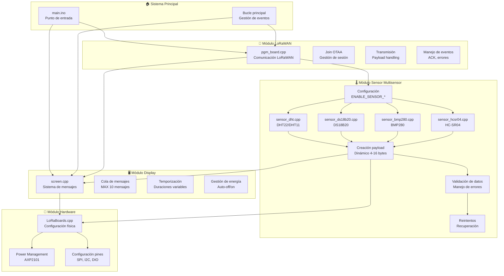
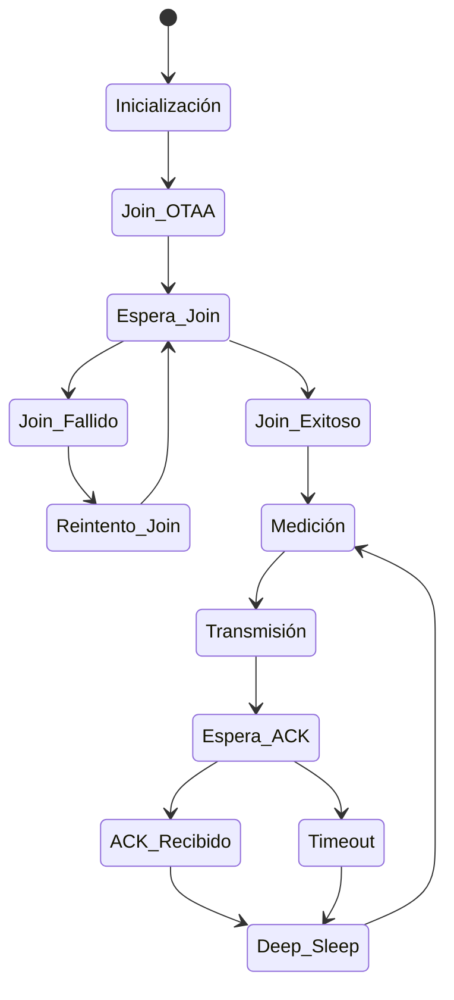
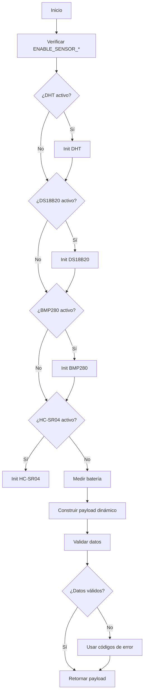
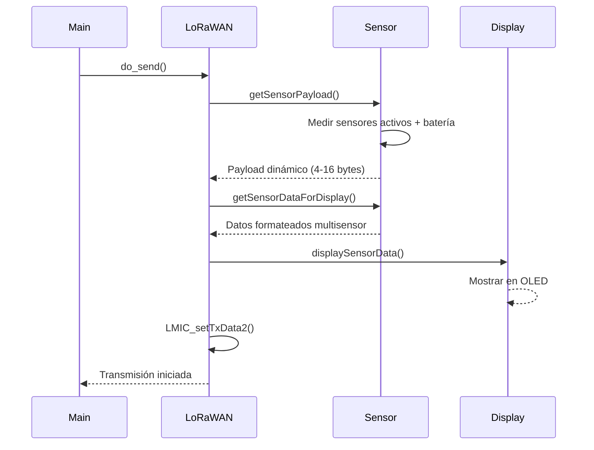
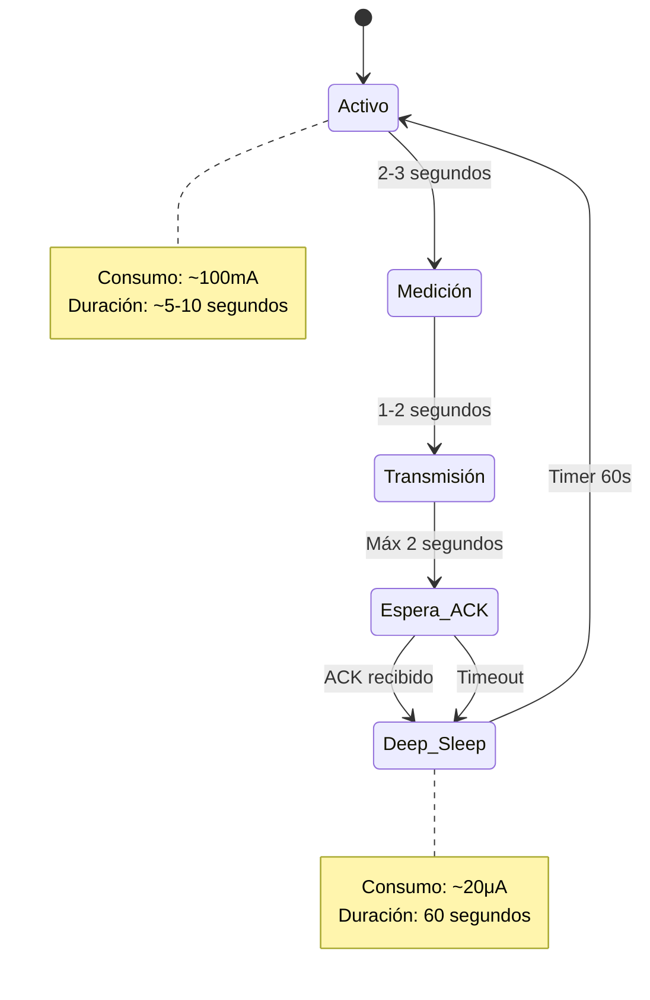

# 🏗️ Arquitectura del Sistema IoT LoRaWAN

## 📋 Visión General

El sistema implementa una arquitectura modular altamente desacoplada, diseñada para máxima robustez, mantenibilidad y eficiencia energética. Cada módulo tiene responsabilidades claras y bien definidas, permitiendo desarrollo independiente y testing aislado.

**Características principales:**
- **Sistema multisensor configurable**: Soporte para múltiples sensores ambientales (temperatura, humedad, presión, distancia) con activación condicional
- **Payload dinámico**: Tamaño y contenido del payload se adapta automáticamente según los sensores activos
- **Compilación condicional**: Solo se incluye el código de los sensores habilitados, optimizando el uso de recursos
- **Gestión energética avanzada**: Deep sleep de 60 segundos con consumo ultra-bajo (~20μA)

## 🧩 Arquitectura Modular



## 📦 Componentes del Sistema

### 🎯 **Módulo Principal (`main.ino`)**
**Responsabilidades:**
- Punto de entrada del programa Arduino
- Inicialización de todos los subsistemas
- Bucle principal de procesamiento de eventos

**Interfaz:**
```cpp
void setup()     // Inicialización única
void loop()      // Ciclo continuo
```

### 📡 **Módulo LoRaWAN (`pgm_board.cpp`)**
**Responsabilidades:**
- Comunicación completa con red LoRaWAN
- Gestión del ciclo de vida OTAA
- Manejo de eventos de transmisión
- Coordinación del ciclo de medición/envío/sueño

**Funciones clave:**
- `setupLMIC()`: Configuración inicial OTAA
- `do_send()`: Ciclo de medición y transmisión
- `onEvent()`: Callbacks de eventos LoRaWAN
- `loopLMIC()`: Procesamiento de eventos

**Estados del ciclo:**


### 🌡️ **Módulo Sensor Multisensor**
**Responsabilidades:**
- Gestión configurable de múltiples sensores ambientales
- Compilación condicional basada en defines ENABLE_SENSOR_*
- Creación dinámica de payloads según sensores activos
- Medición de voltaje de batería (siempre disponible)
- Validación de datos y manejo de errores por sensor

**Sensores soportados:**
- **DHT22/DHT11**: Temperatura y humedad ambiente
- **DS18B20**: Temperatura de precisión
- **BMP280**: Presión atmosférica y temperatura
- **HC-SR04**: Medición de distancia por ultrasonido

**Funciones clave:**
- `initSensors()`: Inicialización condicional de sensores activos
- `getSensorPayload()`: Creación payload dinámico (4-16 bytes)
- `getSensorDataForDisplay()`: Datos formateados para UI
- `isSensorAvailable()`: Estado de disponibilidad por sensor

**Sistema de configuración:**
```cpp
// En config/config.h
#define ENABLE_SENSOR_DHT22     // Activa sensor DHT22
#define ENABLE_SENSOR_DS18B20   // Activa sensor DS18B20
#define ENABLE_SENSOR_BMP280    // Activa sensor BMP280
#define ENABLE_SENSOR_HCSR04    // Activa sensor HC-SR04

// Cálculo dinámico del tamaño del payload
#define PAYLOAD_SIZE_DHT        4   // Temp + Hum (2 bytes cada uno)
#define PAYLOAD_SIZE_DS18B20    2   // Temp (2 bytes)
#define PAYLOAD_SIZE_BMP280     6   // Temp + Pres (2+4 bytes)
#define PAYLOAD_SIZE_HCSR04     2   // Distancia (2 bytes)
#define PAYLOAD_SIZE_BATTERY    2   // Voltaje batería (siempre incluido)
```

**Diagrama de flujo:**


### 🖥️ **Módulo Display (`screen.cpp`)**
**Responsabilidades:**
- Gestión inteligente de la pantalla OLED
- Sistema de cola de mensajes con prioridades
- Temporización automática de mensajes
- Gestión de energía (apagado automático)

**Tipos de mensaje:**
```cpp
enum ScreenMessageType {
    MSG_INFO,           // Información general
    MSG_WARNING,        // Advertencias
    MSG_ERROR,          // Errores
    MSG_SUCCESS,        // Confirmaciones
    MSG_SENSOR_DATA,    // Datos ambientales
    MSG_STATUS          // Estado del sistema
};
```

**Sistema de cola:**
- **Capacidad**: 10 mensajes máximo
- **Prioridad**: FIFO con eliminación de mensajes antiguos
- **Temporización**: Duraciones configurables por tipo
- **Energía**: Auto-apagado después de cada mensaje

### 🔧 **Módulo Hardware (`LoRaBoards.cpp`)**
**Responsabilidades:**
- Configuración física de la placa LilyGo
- Gestión de pines y periféricos
- Control del PMU AXP2101
- Inicialización de buses (SPI, I2C)

**Configuraciones:**
- **SPI**: Comunicación con módulo LoRa
- **I2C**: Sensores y display OLED
- **GPIO**: Control de alimentación y estado
- **PMU**: Gestión de batería y alimentación

## 🔄 Flujos de Datos

### 📊 **Flujo de Medición y Transmisión**


### 🔋 **Flujo de Gestión de Energía**


## 🛡️ Manejo de Errores y Robustez

### 🌡️ **Estrategias de Recuperación Multisensor**
- **Inicialización condicional**: Solo se inicializan sensores con ENABLE_SENSOR_* definido
- **Graceful degradation**: Si un sensor falla, los demás continúan funcionando
- **Lectura inválida**: Reintenta automáticamente, usa valores de error por sensor
- **Sensor desconectado**: Sistema completo sigue funcionando con sensores disponibles
- **Batería siempre disponible**: Medición independiente de los sensores ambientales
- **Payload dinámico**: Tamaño se adapta automáticamente según sensores funcionales

### 📡 **Robustez LoRaWAN**
- **Join fallido**: Reintentos automáticos con backoff
- **Transmisión fallida**: Sistema continúa, próxima transmisión
- **ACK perdido**: No bloquea el ciclo, continúa con deep sleep
- **Sesión expirada**: Re-join automático

### 🖥️ **Gestión de Display**
- **Cola llena**: Eliminación automática de mensajes antiguos
- **Display apagado**: Auto-encendido cuando llegan mensajes
- **Mensajes expirados**: Transición automática al siguiente
- **Energía crítica**: Mensajes prioritarios para batería baja

## 📊 Métricas de Diseño

### ⚡ **Eficiencia Energética**
| Estado | Consumo | Duración | % del Ciclo |
|--------|---------|----------|-------------|
| **Activo** | 100mA | 5-10s | 1.4-2.8% |
| **Deep Sleep** | 20μA | 60s | 97.2-98.6% |
| **Promedio** | 0.5mA | 60s | 100% |

### 💾 **Uso de Recursos**
| Recurso | Uso Base | Con sensores completos | Disponible | % Usado |
|---------|----------|----------------------|------------|---------|
| **Flash** | 320KB | 420KB | 1310KB | 25-32% |
| **RAM** | 22KB | 28KB | 320KB | 7-9% |
| **CPU** | Pico 240MHz | 240MHz | 240MHz | Variable |

### 📡 **Rendimiento LoRaWAN**
| Parámetro | Valor | Notas |
|-----------|-------|-------|
| **Frecuencia** | 868MHz | Banda europea |
| **SF inicial** | 7 | Adaptativo 7-12 |
| **Potencia** | 14dBm | Máxima permitida |
| **Alcance** | 10km | Línea de vista |
| **Tiempo TX** | ~1-2s | Por paquete |

## 🔧 Patrones de Diseño Implementados

### 🏭 **Factory Pattern**
- Creación dinámica de payloads en módulos sensor individuales
- Abstracción de diferentes tipos de sensor con interfaces consistentes
- Compilación condicional para incluir solo código de sensores activos
- Payload builder que concatena datos de sensores habilitados

### 🎯 **Observer Pattern**
- Callbacks LoRaWAN (`onEvent`) para eventos asíncronos
- Sistema de mensajes del display

### 🔄 **State Pattern**
- Estados del ciclo LoRaWAN (join, transmitiendo, durmiendo)
- Estados del display (activo, inactivo, mostrando mensaje)

### 🛡️ **Error Recovery Pattern**
- Graceful degradation cuando fallan componentes
- Códigos de error reconocibles
- Reintentos automáticos con backoff

### ⚡ **Power Management Pattern**
- Estados de bajo consumo bien definidos
- Transiciones automáticas basadas en eventos
- Monitoreo continuo de batería

## 🎯 Principios de Diseño Aplicados

- **🔀 Separación de responsabilidades**: Cada módulo una función clara
- **🔌 Bajo acoplamiento**: Interfaces bien definidas entre módulos
- **🧪 Alta cohesión**: Funcionalidades relacionadas agrupadas
- **🛡️ Fail-safe**: Sistema robusto ante fallos
- **⚡ Eficiencia**: Optimización de recursos y energía
- **📖 Mantenibilidad**: Código claro y bien documentado

---

**🏗️ Arquitectura modular multisensor para máxima robustez y mantenibilidad**