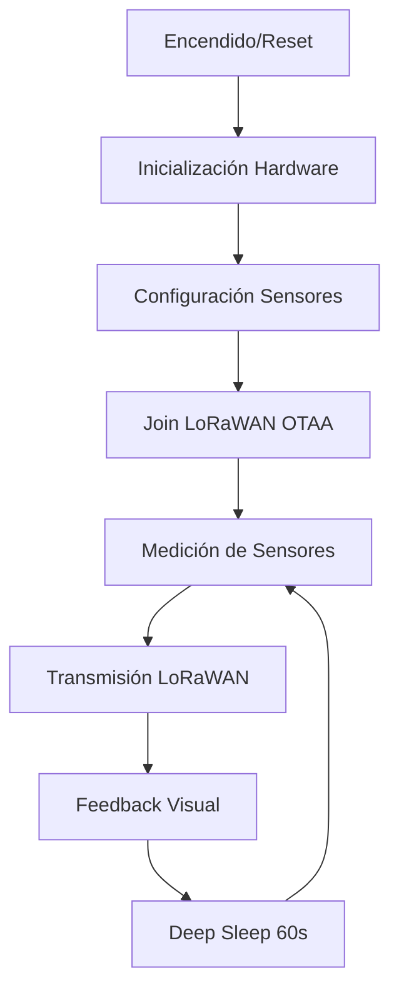

# 🌡️ Sensor IoT LoRaWAN de Bajo Consumo - LilyGo T3

## 📋 Descripción del Proyecto

Sistema IoT avanzado que mide parámetros ambientales (temperatura, humedad, presión) y voltaje de batería, transmitiendo los datos vía LoRaWAN a The Things Network (TTN). Implementa un diseño modular con manejo robusto de errores, gestión inteligente de energía y una interfaz de usuario optimizada.

### ✨ Características Principales

- **📊 Sensores Ambientales**: BME280 (temperatura, humedad, presión barométrica)
- **🔋 Gestión de Energía**: PMU AXP2101 con medición de batería y deep sleep
- **📡 Comunicación LoRaWAN**: OTAA con frecuencia 868MHz (Europa)
- **🖥️ Interfaz OLED**: Sistema de mensajes inteligente con temporización
- **🔄 Robustez**: Continúa funcionando aunque fallen los sensores
- **⚡ Bajo Consumo**: Ciclo de 60 segundos con deep sleep optimizado
- **🏗️ Arquitectura Modular**: Código organizado y mantenible

## 🔄 Ciclo de Operación



### 📱 Estados de la Pantalla OLED

1. **Inicio**: "Proyecto LoRaWAN" → "Bajo Consumo"
2. **Join**: "Uniéndose OTAA...." (persistente)
3. **Conectado**: "Unido a TTN!" (3s) → pantalla off
4. **Transmisión**:
   - ✅ **Con sensor**: "T:23.5C H:65.2% P:1013.2hPa B:3.85V"
   - ⚠️ **Sin sensor**: "Solo bateria" + datos de batería
5. **Confirmación**: "Datos enviados!" (2s)
6. **Reposo**: Pantalla apagada para ahorro de energía

## 📊 Formato del Payload LoRaWAN (8 bytes)

| Bytes | Campo | Tipo | Rango | Escala | Unidad | Descripción |
|-------|-------|------|-------|--------|--------|-------------|
| 0-1 | Temperatura | int16 | -327.68 a 327.67 | ×100 | °C | Temperatura ambiente |
| 2-3 | Humedad | uint16 | 0.00 a 655.35 | ×100 | % | Humedad relativa |
| 4-5 | Presión | uint16 | 0.00 a 655.35 | ×100 | hPa | Presión barométrica |
| 6-7 | Batería | uint16 | 0.00 a 6.55 | ×100 | V | Voltaje de batería LiPo |

### 🔧 Decodificador TTN (JavaScript)

```javascript
function decodeUplink(input) {
  var bytes = input.bytes;
  var data = {};

  // Temperatura (int16 big-endian, complemento a 2)
  var temp_raw = (bytes[0] << 8) | bytes[1];
  if (temp_raw & 0x8000) temp_raw = temp_raw - 0x10000;
  data.temperature = temp_raw / 100.0;

  // Humedad (uint16 big-endian)
  data.humidity = ((bytes[2] << 8) | bytes[3]) / 100.0;

  // Presión (uint16 big-endian)
  data.pressure = ((bytes[4] << 8) | bytes[5]) / 100.0;

  // Batería (uint16 big-endian)
  data.battery_voltage = ((bytes[6] << 8) | bytes[7]) / 100.0;

  return {
    data: data,
    warnings: [],
    errors: []
  };
}
```

### 📈 Valores de Error

Cuando los sensores no están disponibles, el dispositivo envía códigos de error reconocibles:

- **Temperatura**: `-999.0°C` (0xFC18 en complemento a 2)
- **Humedad**: `-1.0%` (0xFFFF)
- **Presión**: `-1.0 hPa` (0xFFFF)
- **Batería**: Siempre disponible (voltaje real)

## 🏗️ Arquitectura del Sistema

```
low-power-project/
├── 📁 src/
│   ├── main.cpp               # 🚀 Punto de entrada Arduino
│   ├── pgm_board.cpp          # 📡 Lógica LoRaWAN y ciclo principal
│   ├── sensor.cpp             # 🌡️ Gestión de sensores BME280
│   ├── screen.cpp             # 🖥️ Sistema de display OLED
│   ├── LoRaBoards.cpp         # 🔧 Configuración hardware LilyGo
│   ├── LoRaBoards.h           # 🔧 Headers hardware
│   └── utilities.h            # 📋 Utilidades
├── 📁 include/
│   ├── sensor.h               # 📋 Headers sensores
│   ├── screen.h               # 📋 Headers display
│   ├── LoRaBoards.h           # 📋 Headers hardware
│   ├── loramac.h              # 📋 Headers LoRaWAN
│   └── utilities.h            # 📋 Utilidades
├── 📁 lib/
│   ├── Adafruit_BME280_Library/  # 🌡️ Librería sensor BME280
│   ├── Adafruit_BusIO/        # 🔧 Bus I2C/SPI Adafruit
│   ├── Adafruit_Sensor/       # 📊 Framework sensores Adafruit
│   ├── LMIC-Arduino/          # 📡 Stack LoRaWAN
│   ├── U8g2/                  # 🖥️ Librería display OLED
│   └── XPowersLib/            # 🔋 Gestión PMU AXP192
├── 📁 docs/                   # 📖 Documentación técnica
├── platformio.ini             # ⚙️ Configuración PlatformIO
└── README.md                  # 📄 Documentación principal
```

### 🧩 Módulos del Sistema

#### **🌡️ Módulo Sensor (`sensor.cpp`)**
- **Responsabilidades**: Lectura BME280, validación de datos, manejo de errores
- **Funciones clave**:
  - `getSensorPayload()`: Crea payload de 8 bytes
  - `getSensorDataForDisplay()`: Datos formateados para UI
  - `isSensorAvailable()`: Estado del sensor

#### **📡 Módulo LoRaWAN (`pgm_board.cpp`)**
- **Responsabilidades**: Comunicación LoRaWAN, ciclo de vida, deep sleep
- **Funciones clave**:
  - `do_send()`: Preparación y envío de datos
  - `onEvent()`: Manejo de eventos LoRaWAN
  - `setupLMIC()`: Inicialización OTAA

#### **🖥️ Módulo Display (`screen.cpp`)**
- **Responsabilidades**: Gestión de mensajes OLED, temporización, ahorro de energía
- **Funciones clave**:
  - `sendScreenMessage()`: Cola de mensajes con tipos
  - `updateDisplay()`: Renderizado y temporización
  - `displaySensorData()`: Formateo de datos ambientales

#### **🔧 Módulo Hardware (`LoRaBoards.cpp`)**
- **Responsabilidades**: Configuración pines, PMU, inicialización periféricos
- **Funciones clave**:
  - `setupBoards()`: Configuración inicial
  - `readBatteryVoltage()`: Medición de batería

## ⚙️ Configuración Técnica

### 🔑 Credenciales LoRaWAN (TTN)

```cpp
// En src/pgm_board.cpp - Actualizar con tus valores de TTN
static const u1_t PROGMEM APPEUI[8] = {0x00, 0x00, 0x00, 0x00, 0x00, 0x00, 0x00, 0x00};
static const u1_t PROGMEM DEVEUI[8] = {0x00, 0x00, 0x00, 0x00, 0x00, 0x00, 0x00, 0x00};
static const u1_t PROGMEM APPKEY[16] = {0x00, 0x00, 0x00, 0x00, 0x00, 0x00, 0x00, 0x00,
                                        0x00, 0x00, 0x00, 0x00, 0x00, 0x00, 0x00, 0x00};
```

### 📊 Parámetros de Operación

| Parámetro | Valor | Descripción |
|-----------|-------|-------------|
| **Intervalo de transmisión** | 60 segundos | Tiempo entre mediciones |
| **Frecuencia LoRa** | 868 MHz | Banda europea |
| **Spreading Factor** | 7-12 | Adaptativo según condiciones |
| **Potencia TX** | 14 dBm | Máxima potencia permitida |
| **Temporización ACK** | 2 segundos | Espera confirmación |
| **Deep Sleep** | 60 segundos | Ahorro de energía |

## 🚀 Inicio Rápido

### 1. Prerrequisitos
- ✅ VS Code con PlatformIO
- ✅ Placa LilyGo T3
- ✅ Antena LoRa 868MHz
- ✅ Batería LiPo 3.7V
- ✅ Cuenta TTN activa

### 2. Configuración
```bash
git clone <repositorio>
cd low-power-project
# Editar credenciales OTAA en src/pgm_board.cpp
```

### 3. Compilación y Carga
```bash
pio run                    # Compilar
pio run --target upload    # Cargar firmware
pio device monitor         # Ver logs
```

### 4. Verificación
- **Serial Monitor**: Mensajes de join y transmisión
- **TTN Console**: Uplinks con datos ambientales
- **OLED Display**: Estados del sistema

## 📚 Documentación Técnica

- **[🚀 Inicio](inicio.md)**: Guía para principiantes - IoT, LoRa, TTN, ESP32
- **[📖 Instalación](instalacion.md)**: Guía paso a paso
- **[🔧 Hardware](hardware.md)**: Especificaciones y conexiones
- **[💻 Software](software.md)**: Dependencias y configuración
- **[🏛️ Arquitectura](arquitectura.md)**: Diseño del sistema
- **[📝 Código](codigo.md)**: Estructura y funciones
- **[🚀 Uso](uso.md)**: Operación y parámetros
- **[📋 Librerías](libreriasyterceros.md)**: Propietarios y licencias
- **[🔍 Troubleshooting](troubleshooting.md)**: Solución de problemas

## 🏆 Características Avanzadas

- **🔄 Robustez**: Funciona sin sensores (envía batería + errores)
- **⚡ Eficiencia**: Gestión inteligente de energía
- **📱 UX Optimizada**: Display contextual con temporización
- **🧪 Testing**: Funciones de depuración incluidas
- **📊 Monitoreo**: Logs detallados y métricas
- **🔧 Mantenibilidad**: Código modular y documentado

## 📈 Métricas de Rendimiento

- **⏱️ Tiempo activo**: ~5-10 segundos por ciclo
- **🔋 Autonomía**: 6-8 meses con batería 18650
- **📡 Alcance LoRa**: Hasta 10km en línea de vista
- **📊 Precisión**: ±0.5°C, ±3% HR, ±1 hPa
- **💾 Flash usado**: ~28% (366KB de 1.3MB)
- **🧠 RAM usado**: ~7.8% (25KB de 320KB)

---

**🎓 Proyecto Educativo IoT** | **📅 Noviembre 2025** | **🏫 Universidad - Proyecto de Bajo Consumo**