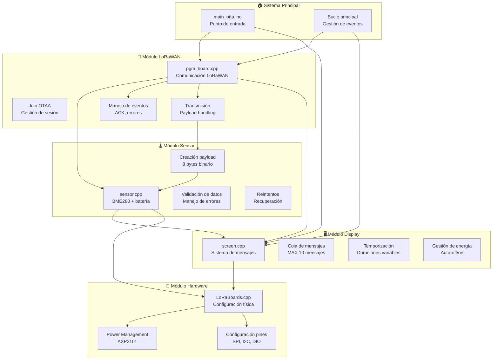
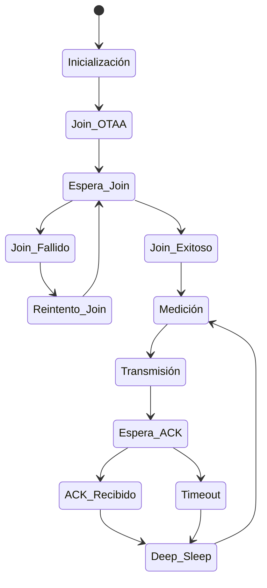
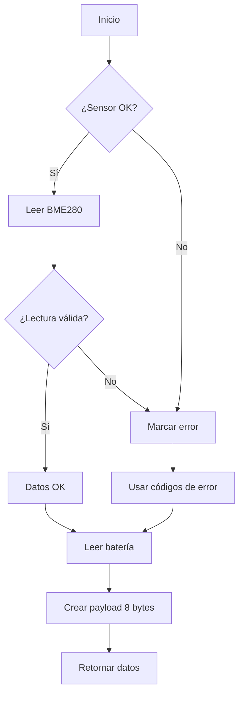
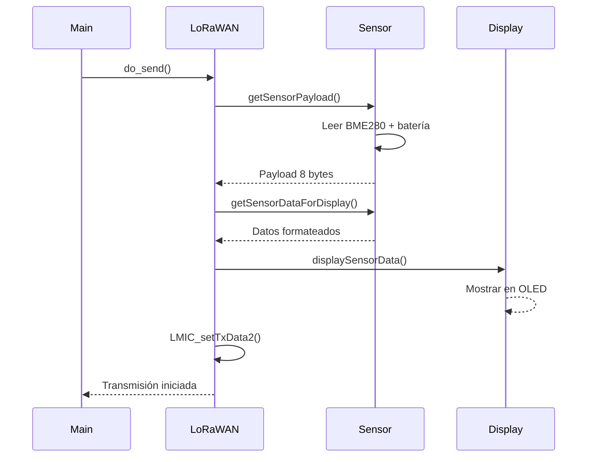
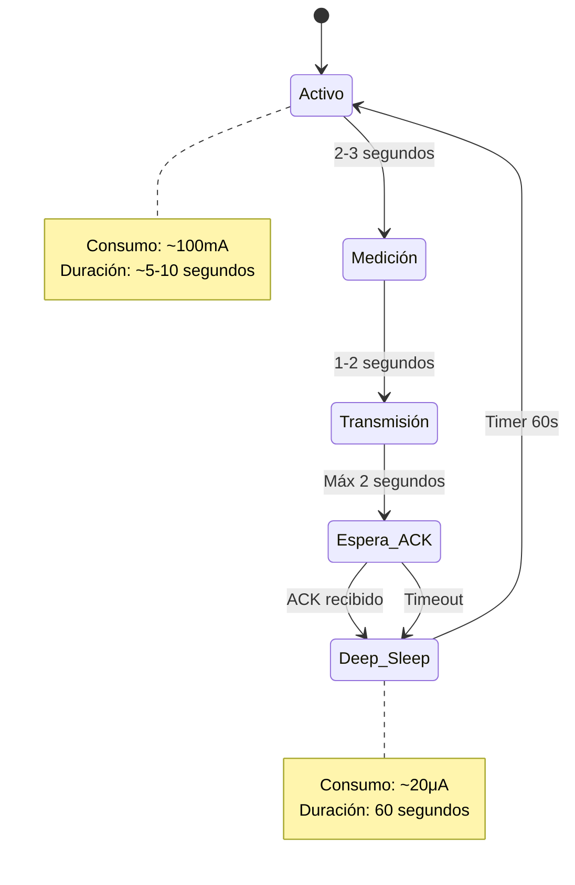

# 🏗️ Arquitectura del Sistema IoT LoRaWAN

## 📋 Visión General

El sistema implementa una arquitectura modular altamente desacoplada, diseñada para máxima robustez, mantenibilidad y eficiencia energética. Cada módulo tiene responsabilidades claras y bien definidas, permitiendo desarrollo independiente y testing aislado.

## 🧩 Arquitectura Modular



## 📦 Componentes del Sistema

### 🎯 **Módulo Principal (`main_otta.ino`)**
**Responsabilidades:**
- Punto de entrada del programa Arduino
- Inicialización de todos los subsistemas
- Bucle principal de procesamiento de eventos

**Interfaz:**
```cpp
void setup()     // Inicialización única
void loop()      // Ciclo continuo
```

### 📡 **Módulo LoRaWAN (`pgm_board.cpp`)**
**Responsabilidades:**
- Comunicación completa con red LoRaWAN
- Gestión del ciclo de vida OTAA
- Manejo de eventos de transmisión
- Coordinación del ciclo de medición/envío/sueño

**Funciones clave:**
- `setupLMIC()`: Configuración inicial OTAA
- `do_send()`: Ciclo de medición y transmisión
- `onEvent()`: Callbacks de eventos LoRaWAN
- `loopLMIC()`: Procesamiento de eventos

**Estados del ciclo:**


### 🌡️ **Módulo Sensor (`sensor.cpp`)**
**Responsabilidades:**
- Gestión completa del sensor BME280
- Medición de parámetros ambientales
- Medición de voltaje de batería
- Validación de datos y manejo de errores
- Creación del payload binario

**Funciones clave:**
- `initSensor()`: Inicialización BME280
- `getSensorPayload()`: Creación payload 8 bytes
- `getSensorDataForDisplay()`: Datos para UI
- `isSensorAvailable()`: Estado del sensor

**Diagrama de flujo:**


### 🖥️ **Módulo Display (`screen.cpp`)**
**Responsabilidades:**
- Gestión inteligente de la pantalla OLED
- Sistema de cola de mensajes con prioridades
- Temporización automática de mensajes
- Gestión de energía (apagado automático)

**Tipos de mensaje:**
```cpp
enum ScreenMessageType {
    MSG_INFO,           // Información general
    MSG_WARNING,        // Advertencias
    MSG_ERROR,          // Errores
    MSG_SUCCESS,        // Confirmaciones
    MSG_SENSOR_DATA,    // Datos ambientales
    MSG_STATUS          // Estado del sistema
};
```

**Sistema de cola:**
- **Capacidad**: 10 mensajes máximo
- **Prioridad**: FIFO con eliminación de mensajes antiguos
- **Temporización**: Duraciones configurables por tipo
- **Energía**: Auto-apagado después de cada mensaje

### 🔧 **Módulo Hardware (`LoRaBoards.cpp`)**
**Responsabilidades:**
- Configuración física de la placa LilyGo
- Gestión de pines y periféricos
- Control del PMU AXP2101
- Inicialización de buses (SPI, I2C)

**Configuraciones:**
- **SPI**: Comunicación con módulo LoRa
- **I2C**: Sensores y display OLED
- **GPIO**: Control de alimentación y estado
- **PMU**: Gestión de batería y alimentación

## 🔄 Flujos de Datos

### 📊 **Flujo de Medición y Transmisión**


### 🔋 **Flujo de Gestión de Energía**


## 🛡️ Manejo de Errores y Robustez

### 🌡️ **Estrategias de Recuperación del Sensor**
- **Inicialización fallida**: Continúa sin sensor, envía códigos de error
- **Lectura inválida**: Reintenta automáticamente, usa valores de error
- **Sensor desconectado**: Sistema completo sigue funcionando
- **Batería siempre disponible**: Medición independiente del sensor BME280

### 📡 **Robustez LoRaWAN**
- **Join fallido**: Reintentos automáticos con backoff
- **Transmisión fallida**: Sistema continúa, próxima transmisión
- **ACK perdido**: No bloquea el ciclo, continúa con deep sleep
- **Sesión expirada**: Re-join automático

### 🖥️ **Gestión de Display**
- **Cola llena**: Eliminación automática de mensajes antiguos
- **Display apagado**: Auto-encendido cuando llegan mensajes
- **Mensajes expirados**: Transición automática al siguiente
- **Energía crítica**: Mensajes prioritarios para batería baja

## 📊 Métricas de Diseño

### ⚡ **Eficiencia Energética**
| Estado | Consumo | Duración | % del Ciclo |
|--------|---------|----------|-------------|
| **Activo** | 100mA | 5-10s | 1.4-2.8% |
| **Deep Sleep** | 20μA | 60s | 97.2-98.6% |
| **Promedio** | 0.5mA | 60s | 100% |

### 💾 **Uso de Recursos**
| Recurso | Uso Actual | Disponible | % Usado |
|---------|------------|------------|---------|
| **Flash** | 366KB | 1310KB | 28% |
| **RAM** | 25KB | 320KB | 7.8% |
| **CPU** | Pico 240MHz | 240MHz | Variable |

### 📡 **Rendimiento LoRaWAN**
| Parámetro | Valor | Notas |
|-----------|-------|-------|
| **Frecuencia** | 868MHz | Banda europea |
| **SF inicial** | 7 | Adaptativo 7-12 |
| **Potencia** | 14dBm | Máxima permitida |
| **Alcance** | 10km | Línea de vista |
| **Tiempo TX** | ~1-2s | Por paquete |

## 🔧 Patrones de Diseño Implementados

### 🏭 **Factory Pattern**
- Creación centralizada de payloads en `sensor.cpp`
- Abstracción de diferentes tipos de sensor

### 🎯 **Observer Pattern**
- Callbacks LoRaWAN (`onEvent`) para eventos asíncronos
- Sistema de mensajes del display

### 🔄 **State Pattern**
- Estados del ciclo LoRaWAN (join, transmitiendo, durmiendo)
- Estados del display (activo, inactivo, mostrando mensaje)

### 🛡️ **Error Recovery Pattern**
- Graceful degradation cuando fallan componentes
- Códigos de error reconocibles
- Reintentos automáticos con backoff

### ⚡ **Power Management Pattern**
- Estados de bajo consumo bien definidos
- Transiciones automáticas basadas en eventos
- Monitoreo continuo de batería

## 🎯 Principios de Diseño Aplicados

- **🔀 Separación de responsabilidades**: Cada módulo una función clara
- **🔌 Bajo acoplamiento**: Interfaces bien definidas entre módulos
- **🧪 Alta cohesión**: Funcionalidades relacionadas agrupadas
- **🛡️ Fail-safe**: Sistema robusto ante fallos
- **⚡ Eficiencia**: Optimización de recursos y energía
- **📖 Mantenibilidad**: Código claro y bien documentado

---

**🏗️ Arquitectura modular para máxima robustez y mantenibilidad**