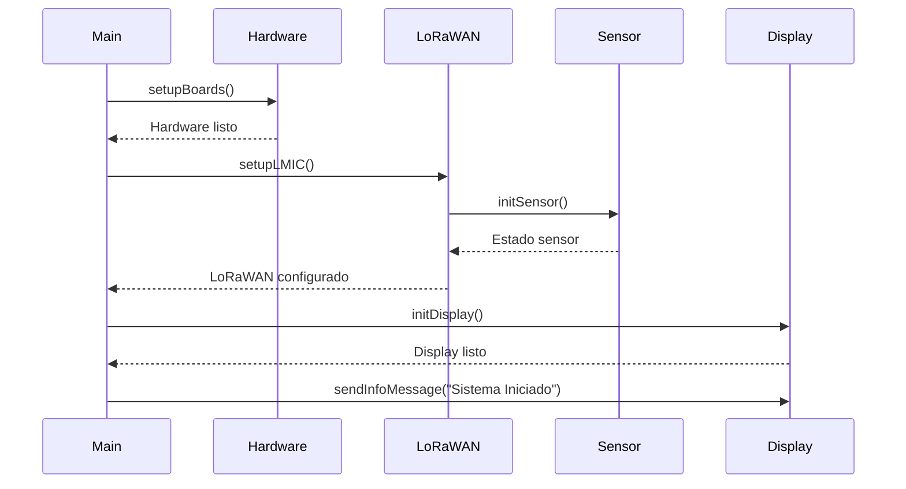
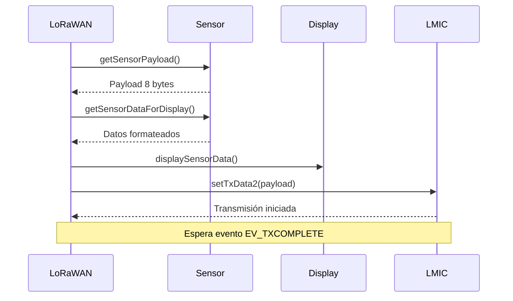

# 📝 Estructura del Código - Arquitectura Modular

## 🏗️ Visión General de la Arquitectura

El código está organizado en **módulos altamente cohesionados y débilmente acoplados**, siguiendo principios de diseño orientado a objetos aplicados a C++. Cada módulo tiene responsabilidades claras, interfaces bien definidas y manejo robusto de errores.

## 📂 Estructura de Archivos

```
low-power-project/
├── 📁 src/
│   ├── main_otta.ino          # 🚀 Punto de entrada Arduino
│   ├── pgm_board.cpp          # 📡 Núcleo LoRaWAN
│   ├── sensor.cpp             # 🌡️ Gestión sensores
│   ├── screen.cpp             # 🖥️ Sistema display
│   └── LoRaBoards.cpp         # 🔧 Configuración hardware
├── 📁 include/
│   ├── sensor.h               # 📋 API sensores
│   ├── screen.h               # 📋 API display
│   ├── LoRaBoards.h           # 📋 API hardware
│   └── utilities.h            # 📋 Utilidades
└── 📁 docs/                   # 📖 Documentación
```

## 🎯 Módulos del Sistema

### 🚀 **Módulo Principal (`main_otta.ino`)**

**Propósito**: Punto de entrada del programa Arduino, coordinación de inicialización.

```cpp
void setup() {
    setupBoards(false);        // 🔧 Hardware
    delay(1500);               // ⏱️ Estabilización
    setupLMIC();              // 📡 LoRaWAN
    initDisplay();            // 🖥️ Display
    sendInfoMessage("Sistema Iniciado", 3000);
}

void loop() {
    loopLMIC();               // 📡 Procesar LoRaWAN
    updateDisplay();          // 🖥️ Gestionar display
}
```

### 📡 **Módulo LoRaWAN (`pgm_board.cpp`)**

**Propósito**: Gestión completa del ciclo de vida LoRaWAN y coordinación del sistema.

#### 🔑 **Constantes de Configuración**
```cpp
#define SLEEP_TIME_SECONDS 60          // ⏰ Ciclo de 60 segundos
#define TX_INTERVAL 30                 // 📡 Intervalo TX (no usado en bajo consumo)

// Credenciales OTAA - ¡CONFIGURAR CON TUS VALORES TTN!
static const u1_t PROGMEM APPEUI[8] = {0x00, 0x00, 0x00, 0x00, 0x00, 0x00, 0x00, 0x00};
static const u1_t PROGMEM DEVEUI[8] = {0x00, 0x00, 0x00, 0x00, 0x00, 0x00, 0x00, 0x00};
static const u1_t PROGMEM APPKEY[16] = {0x00, 0x00, 0x00, 0x00, 0x00, 0x00, 0x00, 0x00,
                                        0x00, 0x00, 0x00, 0x00, 0x00, 0x00, 0x00, 0x00};
```

#### 🔄 **Función Principal: `do_send()`**
```cpp
void do_send(osjob_t *j) {
    // 1. Verificar estado de join
    if (joinStatus == EV_JOINING) {
        Serial.println("Aún no unido a la red");
        os_setTimedCallback(&sendjob, os_getTime() + sec2osticks(TX_INTERVAL), do_send);
        return;
    }

    // 2. Verificar transmisión pendiente
    if (LMIC.opmode & OP_TXRXPEND) {
        Serial.println("Transmisión pendiente, esperando...");
        return;
    }

    // 3. Obtener payload del sensor
    uint8_t payload[7];
    uint8_t payloadSize = getSensorPayload(payload, sizeof(payload));

    if (payloadSize == 0) {
        Serial.println("Error al obtener payload");
        os_setTimedCallback(&sendjob, os_getTime() + sec2osticks(10), do_send);
        return;
    }

    // 4. Obtener datos para display
    float temp, hum, pres, batt;
    bool sensorOk = getSensorDataForDisplay(temp, hum, pres, batt);

    // 5. Mostrar en pantalla
    if (sensorOk) {
        displaySensorData(temp, hum, pres, batt, 5000);
    } else {
        sendWarningMessage("Solo bateria", 3000);
    }

    // 6. Transmitir por LoRaWAN
    LMIC_setTxData2(1, payload, payloadSize, 0);

    // 7. Logging
    if (sensorOk) {
        Serial.printf("Enviando: T=%.2f°C, H=%.2f%%, P=%.2f hPa, B=%.2fV\n",
                     temp, hum, pres, batt);
    } else {
        Serial.printf("Enviando datos limitados: B=%.2fV\n", batt);
    }
}
```

#### 📞 **Manejo de Eventos: `onEvent()`**
```cpp
void onEvent(ev_t ev) {
    switch (ev) {
        case EV_TXCOMPLETE:
            // Verificar ACK recibido
            if (LMIC.txrxFlags & TXRX_ACK) {
                Serial.println("ACK recibido de gateway");
            }

            // Mostrar métricas de enlace
            Serial.printf("RSSI: %d dBm, SNR: %d dB\n", LMIC.rssi, LMIC.snr);

            // Feedback visual
            sendSuccessMessage("Datos enviados!", 2000);

            // Entrar en deep sleep
            enterDeepSleep();
            break;

        case EV_JOINING:
            Serial.println("Iniciando proceso de join...");
            sendInfoMessage("Uniéndose OTAA....", 0); // Persistente
            break;

        case EV_JOIN_FAILED:
            Serial.println("Join fallido - reintentando...");
            sendWarningMessage("Unión fallida, reintentando...", 3000);
            os_setTimedCallback(&sendjob, os_getTime() + sec2osticks(10), do_send);
            break;

        case EV_JOINED:
            Serial.println("Unión exitosa a la red LoRaWAN");
            sendSuccessMessage("Unido a TTN!", 3000);
            delay(2000);
            turnOffDisplay(); // Ahorro de energía
            LMIC_setLinkCheckMode(0);
            break;
    }
}
```

### 🌡️ **Módulo Sensor (`sensor.cpp`)**

**Propósito**: Gestión completa de sensores ambientales y batería.

#### 📊 **Payload Format (7 bytes)**
```cpp
uint8_t getSensorPayload(uint8_t* payload, uint8_t maxSize) {
    // Validar buffer
    if (maxSize < 8) return 0;

    // Leer sensores
    float temp = readTemperature();
    float hum = readHumidity();
    float pres = readPressure();
    float batt = readBatteryVoltage();

    // Aplicar códigos de error si sensor falla
    bool sensorOk = isSensorAvailable();
    if (!sensorOk || temp == -999.0f) temp = -999.0f;
    if (!sensorOk || hum == -1.0f) hum = -1.0f;
    if (!sensorOk || pres == -1.0f) pres = -1.0f;

    // Empaquetar en big-endian
    int16_t temp_int = (int16_t)(temp * 100);
    uint16_t hum_int = (uint16_t)(hum * 100);
    uint16_t batt_int = (uint16_t)(batt * 100);

    payload[0] = temp_int >> 8;    payload[1] = temp_int & 0xFF;  // Temperatura
    payload[2] = hum_int >> 8;     payload[3] = hum_int & 0xFF;   // Humedad
    payload[4] = batt_int >> 8;    payload[5] = batt_int & 0xFF;  // Batería
    payload[6] = solar_charging ? 1 : 0;                         // Estado solar

    return 7;
}
```

#### 🔍 **Validación de Datos**
```cpp
bool getSensorDataForDisplay(float& temp, float& hum, float& pres, float& battery) {
    bool sensorOk = isSensorAvailable();

    if (sensorOk) {
        temp = readTemperature();
        hum = readHumidity();
        pres = readPressure();

        // Verificar lecturas válidas
        if (temp == -999.0f || hum == -1.0f || pres == -1.0f) {
            sensorOk = false;
        }
    }

    // Usar códigos de error si sensor falla
    if (!sensorOk) {
        temp = -999.0f;
        hum = -1.0f;
        pres = -1.0f;
    }

    // Batería siempre disponible
    battery = readBatteryVoltage();

    return sensorOk;
}
```

### 🖥️ **Módulo Display (`screen.cpp`)**

**Propósito**: Sistema inteligente de gestión de mensajes OLED.

#### 📋 **Sistema de Cola de Mensajes**
```cpp
#define MAX_SCREEN_MESSAGES 10
static ScreenMessage messageQueue[MAX_SCREEN_MESSAGES];
static int messageCount = 0;
static int currentMessageIndex = -1;

// Tipos de mensaje con semántica clara
enum ScreenMessageType {
    MSG_INFO,           // Información general (azul)
    MSG_WARNING,        // Advertencias (amarillo)
    MSG_ERROR,          // Errores (rojo)
    MSG_SUCCESS,        // Confirmaciones (verde)
    MSG_SENSOR_DATA,    // Datos ambientales (blanco)
    MSG_STATUS          // Estado del sistema (gris)
};
```

#### 🔄 **Función Principal: `updateDisplay()`**
```cpp
void updateDisplay() {
    if (!u8g2 || !displayActive) return;

    uint32_t currentTime = millis();

    // Evitar flickering excesivo
    if (currentTime - lastUpdateTime < 100) return;
    lastUpdateTime = currentTime;

    // Encontrar siguiente mensaje a mostrar
    int nextMessageIndex = getNextMessageIndex();

    if (nextMessageIndex != currentMessageIndex || screenNeedsUpdate) {
        if (nextMessageIndex >= 0) {
            currentMessageIndex = nextMessageIndex;
            ScreenMessage& message = messageQueue[currentMessageIndex];
            renderMessage(message);
            message.displayed = true;
            currentMessageStartTime = currentTime;
        } else {
            // No hay mensajes, apagar display
            turnOffDisplay();
        }
        screenNeedsUpdate = false;
    }

    // Verificar expiración del mensaje actual
    if (currentMessageIndex >= 0 && currentMessageIndex < messageCount) {
        ScreenMessage& currentMsg = messageQueue[currentMessageIndex];
        if (currentMsg.duration > 0 &&
            (currentTime - currentMsg.timestamp) >= currentMsg.duration) {
            screenNeedsUpdate = true;
        }
    }
}
```

#### 📺 **Renderizado de Mensajes**
```cpp
void renderMessage(const ScreenMessage& message) {
    u8g2->clearBuffer();
    u8g2->setFont(u8g2_font_ncenB08_tr);

    // Mostrar tipo de mensaje
    const char* typeStr = "";
    switch (message.type) {
        case MSG_INFO: typeStr = "[INFO]"; break;
        case MSG_WARNING: typeStr = "[WARN]"; break;
        case MSG_ERROR: typeStr = "[ERROR]"; break;
        case MSG_SUCCESS: typeStr = "[OK]"; break;
        case MSG_SENSOR_DATA: typeStr = "[DATA]"; break;
        case MSG_STATUS: typeStr = "[STATUS]"; break;
    }

    u8g2->drawStr(0, 10, typeStr);

    // Renderizar texto con word wrap
    String text = message.text;
    int yPos = 25;
    while (text.length() > 0 && yPos < 60) {
        // Lógica de word wrap...
        u8g2->drawStr(0, yPos, line.c_str());
        yPos += 12;
    }

    u8g2->sendBuffer();
}
```

### 🔧 **Módulo Hardware (`LoRaBoards.cpp`)**

**Propósito**: Abstracción completa del hardware LilyGo.

#### ⚙️ **Configuración de Pines**
```cpp
// Mapeo de pines para ESP32-S3
const lmic_pinmap lmic_pins = {
    .nss = RADIO_CS_PIN,
    .rxtx = LMIC_UNUSED_PIN,
    .rst = RADIO_RST_PIN,
    .dio = {RADIO_DIO0_PIN, RADIO_DIO1_PIN, RADIO_DIO2_PIN}
};
```

#### 🔋 **Gestión de Energía**
```cpp
void setupBoards(bool isTx) {
    // Configurar pines SPI, I2C
    // Inicializar PMU AXP2101
    // Configurar sensores de batería
    // Setup display OLED
}

float readBatteryVoltage() {
    // Lectura del ADC de batería
    // Cálculo de voltaje real
    return voltage;
}
```

## 🔄 Flujos de Ejecución

### 🚀 **Secuencia de Inicio**


### 📡 **Ciclo de Medición y Transmisión**


## 🛡️ Estrategias de Error Handling

### 🌡️ **Recuperación de Sensor**
```cpp
bool initSensor() {
    // Configurar control de alimentación
    pinMode(DHT_POWER_PIN, OUTPUT);
    digitalWrite(DHT_POWER_PIN, LOW); // Empezar apagado

    // Inicializar objeto DHT
    DHT dht(DHT_PIN, DHT_TYPE);
    dht.begin();

    Serial.println("Sensor DHT22 inicializado");
    sensorAvailable = true;
    return true;
}

bool retrySensorInit() {
    if (sensorAvailable) return true;
    Serial.println("Reintentando inicialización DHT22...");
    return initSensor();
}
```

### 📡 **Robustez LoRaWAN**
- **Join fallido**: Reintento automático con backoff
- **Transmisión fallida**: Sistema continúa, no bloquea
- **ACK perdido**: Timeout de 2 segundos, continúa ciclo
- **Sesión expirada**: Re-join automático

### 🖥️ **Gestión de Display**
- **Cola llena**: FIFO con eliminación de mensajes antiguos
- **Display off**: Auto-on cuando llegan nuevos mensajes
- **Mensajes expirados**: Transición automática
- **Memoria limitada**: Gestión eficiente de strings

## 📊 Complejidad y Métricas

### 📈 **Complejidad Ciclomática**
| Función | Complejidad | Razón |
|---------|-------------|-------|
| `do_send()` | 4 | Múltiples verificaciones de estado |
| `onEvent()` | 6 | Switch con múltiples casos |
| `updateDisplay()` | 5 | Lógica de cola y temporización |
| `getSensorPayload()` | 3 | Validación y empaquetado |

### 💾 **Uso de Memoria**
| Componente | Flash | RAM | Notas |
|------------|-------|-----|-------|
| **LoRaWAN** | 180KB | 8KB | LMIC library |
| **Sensor** | 15KB | 2KB | DHT22 + variables |
| **Display** | 25KB | 4KB | U8g2 + cola mensajes |
| **Hardware** | 35KB | 3KB | Configuración pines |
| **Total** | 255KB | 17KB | ~20% del total |

### ⚡ **Rendimiento**
| Operación | Tiempo | Consumo |
|-----------|--------|---------|
| **Lectura DHT22** | 10ms | 15mA |
| **Transmisión LoRa** | 1-2s | 120mA |
| **Deep Sleep** | 60s | 20μA |
| **Display Update** | 50ms | 25mA |

## 🎯 Patrones de Diseño Aplicados

### 🏭 **Factory Pattern**
```cpp
// sensor.cpp crea payloads de diferentes tipos
uint8_t getSensorPayload(uint8_t* buffer, uint8_t size) {
    // Lógica de creación centralizada
    return createEnvironmentalPayload(buffer, size);
}
```

### 🎪 **Observer Pattern**
```cpp
// Callbacks LoRaWAN para eventos asíncronos
void onEvent(ev_t ev) {
    switch (ev) {
        case EV_TXCOMPLETE: handleTransmissionComplete();
        case EV_JOINED: handleJoinSuccess();
        // ...
    }
}
```

### 🔄 **State Pattern**
```cpp
// Estados del sistema LoRaWAN
enum LoRaWANState {
    STATE_JOINING,
    STATE_JOINED,
    STATE_TRANSMITTING,
    STATE_SLEEPING
};
```

### 🛡️ **Fail-Safe Pattern**
```cpp
// Sistema continúa funcionando aunque fallen componentes
if (!sensorOk) {
    // Enviar códigos de error reconocibles
    temp = -999.0f;  // Código de error temperatura
    hum = -1.0f;     // Código de error humedad
    // Batería siempre disponible
}
```

## 🔧 Consideraciones de Mantenibilidad

### 📝 **Convenciones de Código**
- **Funciones**: Nombres descriptivos en inglés
- **Variables**: camelCase para locales, snake_case para globales
- **Constantes**: MAYUSCULAS_CON_GUIONES
- **Comentarios**: Doxygen format para documentación

### 🧪 **Testing y Debugging**
```cpp
// Función de testing para simular fallos
void setSensorAvailableForTesting(bool available) {
    sensorAvailable = available;
    Serial.printf("TESTING: Sensor %s\n", available ? "habilitado" : "deshabilitado");
}
```

### 📊 **Monitoreo y Logs**
- **Serial output**: Niveles INFO, WARN, ERROR
- **Estados del sistema**: Logging de transiciones
- **Métricas**: RSSI, SNR, voltaje de batería
- **Errores**: Códigos específicos y mensajes descriptivos

---

**🏗️ Código modular, robusto y mantenible para aplicaciones IoT críticas**